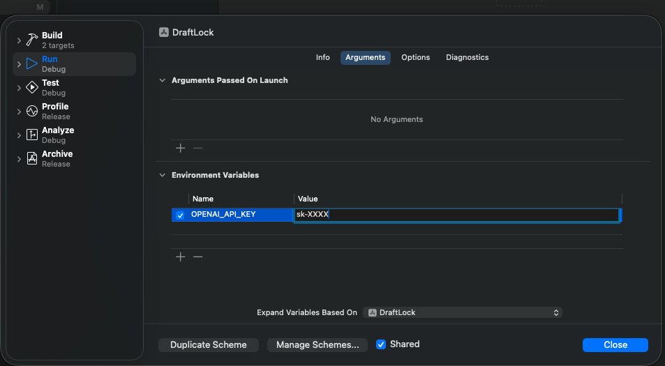

# DraftLock MAC OS Only
A small macOS app that rewrites text into context-appropriate drafts
before posting to Slack, Notion, or GitHub PRs.

## Usage
1. Paste raw text
2. Select mode (Chat / Doc / PR)
3. Transform
4. Copy & paste

## Environment
Create `.env` with:

OPENAI_API_KEY=your_key_here

## Roadmap

DraftLock is designed to be backend-agnostic.

While the current implementation uses the OpenAI API,
there is a clear intention to support local LLMs
(e.g. llama.cpp or similar) in the future.

The goal is not to change the user experience,
but to allow different inference backends
depending on the environment and constraints.

The transformation logic is intentionally isolated
from the inference backend.

## 今後の拡張について(JA)向け

DraftLock は特定のAIサービスに依存しない設計を意図しています。

現時点では OpenAI API を利用していますが、
APIキーは、ビルド前にEdit Schemaで設定してください

将来的にはローカルLLM（例: llama.cpp 等）を
バックエンドとして利用できる構成も視野に入れています。

利用体験は変えず、
実行環境に応じて推論基盤を切り替えられることを目標としています。
